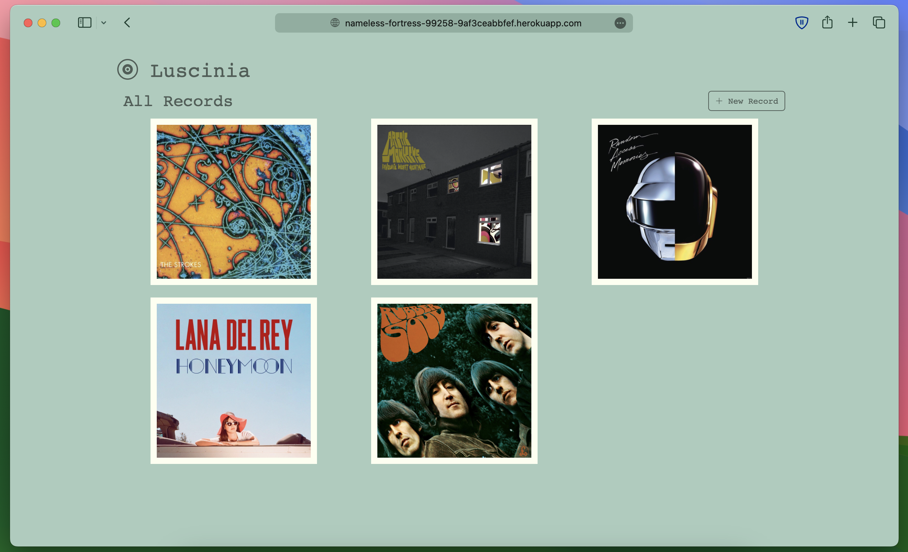

# Luscinia

A music record management app.



### Installation

We will install Ruby on Rails in our local development environment.

Go to the Github directory created by `Github Desktop`:

```bash
cd ~/Documents/Github
```

Install Rails:

```bash
gem install rails
```

Check installed version:

```bash
rails -v
```

### A New App

Create a new Rails app:

```bash
rails new myapp --database=postgresql
```

```bash
cd myapp
```

Create a local database:

```bash
bin/rails db:create
```

**After removing the default welcome page**, create a `Procfile`: 

Deploying a Rails 7 app without a Procfile executes the following command, but Heroku [recommends](https://devcenter.heroku.com/articles/getting-started-with-rails7#create-a-procfile) explicitly declaring how to boot the server process.

```bash
echo "web: bundle exec puma -C config/puma.rb" > Procfile
```

### Deployment

Create a Heroku app:

```bash
heroku create
```

Add the `x86_64-linux` and `ruby` platforms to `Gemfile.lock`.

```bash
bundle lock --add-platform x86_64-linux --add-platform ruby
```

Create a database addon for your Heroku app:

```bash
heroku addons:create heroku-postgresql:mini
```

Deploy:

```bash
git push heroku main
```

Migrate the database:
```bash
heroku run rake db:migrate
```

Done!